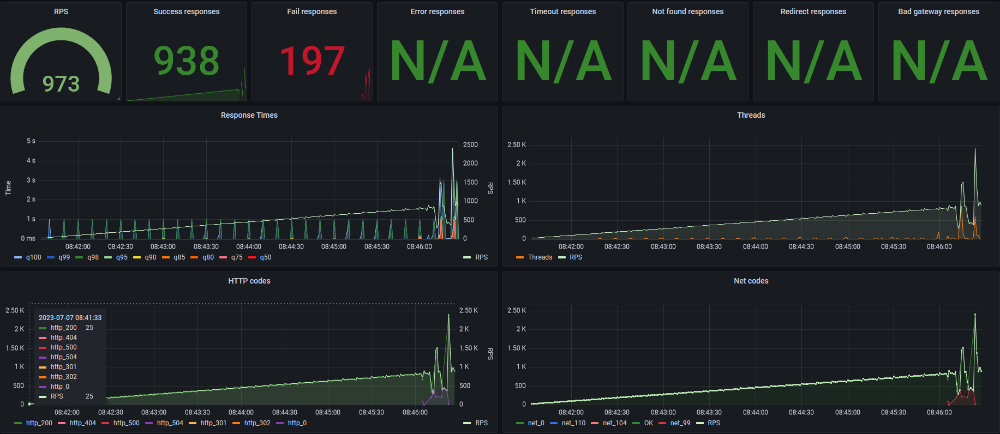

# Load testing stand

Stand for load testing with yandex tank and grafana dashboard

## Graph samples

Here is some sample graph.



## Installing / Getting started

```bash
git clone git@github.com:l-SK-l/Yandex-Tank-influxDB-Grafana.git
cd load-testing-stand
./start.sh
```
After start, the grafana board will open in the default browser with monitoring of load testing

To create the Database
```bash
docker exec -it "CONTAINER ID" influx
> CREATE DATABASE influx
> SHOW DATABASES
> exit
```

## Configuration

The project contains predefined settings in tests/config.yml

```yaml
phantom:
  enabled: true
  address: IP:PORT #Server address and port
  #ammofile: ammo.txt
  #ammo_type: uri
  uris: #Path
  - /index.html
  load_profile:
    load_type: rps
    schedule: line(10, 100, 60s)
  #load_profile:
    #load_type: instances
    #schedule: line(1,150,100s) const(150,2h)
  #headers:
   # - "[Host: www.example.com]"

# Uncomment this if you want to autostop load testing
# autostop:    
  # autostop: 
    # - http(5xx,25%,1s)  

console: #Console output at runtime
  enabled: true

telegraf:
  enabled: false

influx:
  enabled: true
  address: influx
  port: 8086
  database: influx
  tank_tag: 'mytank'
```
tests/ammo.txt contains settings of requests of load testing. You can write your ammo.txt generator and add it to start.sh script

If you want to know about a more advanced configuration of Yandex tank use the [link](https://yandextank.readthedocs.io/en/latest/config_reference.html)
